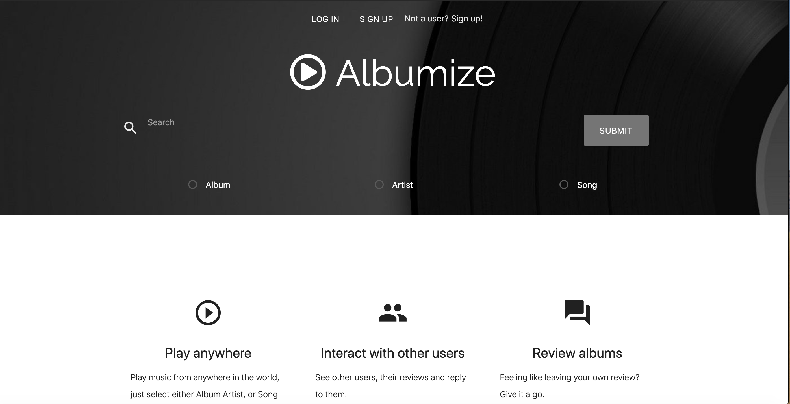

# Albumize
## An Album Review application

* This application utilizes the following:

1. NODE/EXPRESS SERVER
2. MYSQL DB
3. HEROKU
4. HANDLEBARS

* MySQL Database 
    - Main Table:
        * Users
    - Relational Tables:
        * Top Rated,
        * Most Commented,
        * Latest Review
* GET and POST routes for retrieving and adding new data;
    * GET routes
    * POST routes

Format: 

**[LinkedIn](https://www.linkedin.com/in/jason-lloyd-a0ba9529/)**

**[Albumize App](https://glacial-tundra-34381.herokuapp.com/)**

**[Github repo](https://github.com/jll9qw/AlbumReviewBlog.git)**